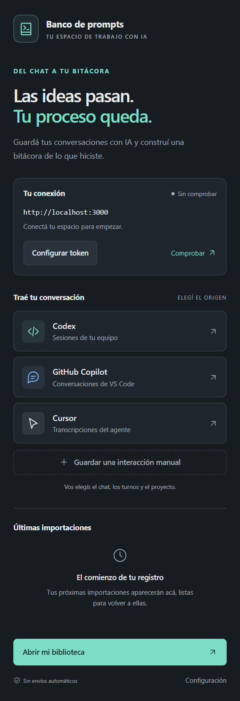

# Banco de prompts

**De la conversación con IA a una bitácora organizada.**

Importá conversaciones locales de Codex, Copilot Chat y Cursor, elegí los turnos que querés conservar y guardalos en un proyecto de Banco de prompts. También podés registrar un prompt y su respuesta manualmente, usando la selección del editor como punto de partida.

*Vista del panel renderizado con configuración de ejemplo, sin conversaciones personales.*

## Qué incluye

- Panel lateral con accesos a cada fuente y al registro manual.
- Configuración de conexión, comprobación explícita y mensajes de error claros.
- Selección del último turno, de todos los turnos o de interacciones puntuales.
- Destino en una sesión nueva o existente de tu proyecto.
- Historial local de las últimas ocho importaciones, con acceso a la sesión guardada.
- Interfaz que acompaña el tema de VS Code y token guardado en SecretStorage.

## Antes de empezar

La extensión requiere **VS Code de escritorio 1.90 o superior**, un espacio de trabajo de confianza y una instancia de la [app Banco de prompts](https://github.com/agus476/banco-de-prompts) iniciada, con `IMPORT_TOKEN` configurado y al menos un proyecto creado. Instalar la extensión no instala el servidor ni la base de datos.

El servidor utiliza PostgreSQL y Supabase Auth. Seguí la [configuración de la app](https://github.com/agus476/banco-de-prompts#iniciar-la-app-web) para prepararlo. El inicio de sesión web y el token de importación son credenciales independientes.

## Instalación y conexión

1. En VS Code, abrí **Extensions → … → Install from VSIX…** y seleccioná `banco-de-prompts-0.3.0.vsix`.
2. Abrí **Banco de prompts** en la barra de actividad.
3. Configurá `banco.apiUrl`: por ejemplo, `http://localhost:3000` o la URL HTTPS de tu app.
4. Pulsá **Configurar token** y pegá el mismo `IMPORT_TOKEN` del servidor; al guardarlo se comprueba la conexión.
5. Usá **Comprobar** cuando quieras volver a consultar el estado.

Para generar el VSIX desde el código fuente, consultá [PUBLISHING.md](./PUBLISHING.md).

## Importar una conversación

Elegí **Codex**, **GitHub Copilot** o **Cursor** en el panel. Seleccioná el chat, los turnos a importar, el proyecto y una sesión nueva o existente. Al finalizar, podés abrir la sesión en la app.

Los mismos flujos están en la paleta de comandos:

| Comando | Uso |
| --- | --- |
| `Banco: Importar chat` | Elegir la fuente. |
| `Banco: Importar chat de Codex` | Leer sesiones locales de Codex. |
| `Banco: Importar chat de VS Code` | Leer chats locales de Copilot. |
| `Banco: Importar chat de Cursor` | Leer transcripciones locales de Cursor. |
| `Banco: Guardar interacción manual` | Escribir o pegar prompt y respuesta. |

La selección de un destino completa la importación. Revisá los turnos que elegís antes de continuar; los textos pueden contener código o información privada.

## Configuración

| Ajuste | Valor inicial | Función |
| --- | --- | --- |
| `banco.apiUrl` | `http://localhost:3000` | URL base de la app. |
| `banco.defaultProjectId` | Vacío | Omite la elección de proyecto cuando el ID existe. |
| `banco.defaultTool` | `Codex` | Herramienta asignada al registro manual. |

El token es obligatorio, incluso en localhost. Se guarda por URL en SecretStorage; al cambiar de servidor, configurá su token. El antiguo ajuste global `banco.importToken` se migra al almacén seguro y se elimina de la configuración global. No se aceptan tokens provenientes de ajustes del repositorio.

Las conexiones remotas requieren HTTPS. HTTP sólo se permite con `localhost`, `127.0.0.1` o `[::1]`; las URLs no deben incluir usuario, contraseña, parámetros ni fragmentos.

## Fuentes y compatibilidad

La extensión consulta archivos locales al ejecutar una importación:

| Fuente | Ubicación |
| --- | --- |
| Codex | `sessions` y `archived_sessions` dentro de `CODEX_HOME` o, por defecto, `~/.codex`. |
| Cursor | `~/.cursor/projects/*/agent-transcripts`. |
| Copilot Chat | Carpetas `workspaceStorage` y `globalStorage/emptyWindowChatSessions` de `Code/User` y `Code - Insiders/User`. |

Para VS Code, el directorio de datos se obtiene de `%APPDATA%` en Windows, `~/Library/Application Support` en macOS y `XDG_CONFIG_HOME` o `~/.config` en Linux.

Las rutas se resuelven para Windows, macOS y Linux. La extensión se ejecuta en el host local de VS Code: no busca conversaciones dentro de un servidor SSH, contenedor o WSL remoto. No funciona en `vscode.dev`.

Estos importadores leen formatos internos que pueden cambiar entre versiones de las herramientas. Importan texto reconocible; no garantizan recuperar adjuntos, imágenes, llamadas a herramientas ni todos los chats. Si una conversación no aparece, usá el registro manual.

## Si algo falla

| Situación | Qué revisar |
| --- | --- |
| No se conecta | App iniciada, puerto y `banco.apiUrl`. |
| Token incorrecto (`401`) | Volvé a guardar el mismo `IMPORT_TOKEN` del servidor. |
| Importación sin configurar (`503`) | Definí `IMPORT_TOKEN` en la app y reiniciala. |
| No hay proyectos | Creá una materia y un proyecto desde la web. |
| No aparecen chats | Conversaciones guardadas localmente y formato compatible; probá el registro manual. |
| La solicitud tarda demasiado | Revisá la bitácora antes de reintentar: el servidor podría haber guardado la importación. |

La extensión no agrega telemetría ni envía conversaciones a proveedores de IA. Los turnos seleccionados se envían a la app que configuraste. El historial guarda fuente, fecha, cantidad y enlace, sin copiar prompts ni respuestas. Más información en [Privacidad](./PRIVACY.md).

[Código e incidencias](https://github.com/agus476/banco-de-prompts/issues) · [Cambios](./CHANGELOG.md) · [Licencia MIT](./LICENSE)
